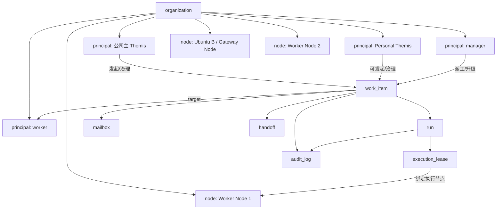
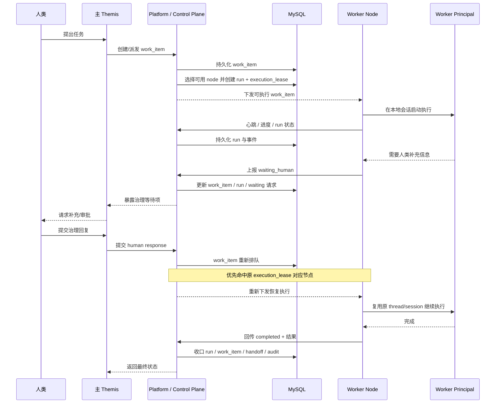

# Themis 局域网多节点硅基员工平台方案（V1 草案）

更新时间：2026-04-12 12:05 CST
文档性质：产品/架构讨论稿，用于沉淀“把当前单机 Themis 的数字员工能力升级为公司级平台”的共识与分阶段路线。

补充说明：

- 本文主要固定方向、边界、对象模型和 V1 形态。
- 如果接下来要继续看“具体该按什么顺序推进、每阶段做到什么才算完成”，另见：[Themis 局域网多节点硅基员工平台 / 分阶段落地计划](./themis-silicon-employee-platform-roadmap-plan.md)。

## 1. 这份文档解决什么问题

当前 Themis 的数字员工能力，主体、调度、状态、执行边界和运行历史都由单机 Themis 自己维护：

- 管理面在本机
- 调度在本机
- 持久化在本机
- 执行资源也主要消耗本机

这套模型适合“单机长期助理”或“小范围自托管”，但当目标变成下面这件事时，就会开始吃力：

- 公司内存在多个长期硅基个体
- 公司主入口 Themis 需要统一管理它们
- 不同机器都希望贡献执行资源
- 公司希望统一查看所有数字员工的状态、队列、交接和治理动作
- 某些人类合伙人还希望拥有自己的 Themis 助理，并让它进入公司硅基层级

这份文档的目标，就是把上面的方向收敛成一版可落地的 V1 草案。

## 2. 当前讨论共识

### 2.1 数字员工是逻辑主体，不是物理进程名

平台里真正长期存在的对象应该是“硅基个体 / principal”。

它们逻辑上都算独立个体，包括：

- 公司级主 Themis
- 各层 manager 型数字员工
- specialist / worker 型数字员工
- 人类合伙人的个人 Themis 助理

但“逻辑上独立个体”不等于“物理上每人跑一个完整 Themis 实例”。

### 2.2 Themis 是入口形态之一，但主 Themis 本身也是组织级主体

`Themis` 既是一种入口形态，也可以是平台里的真实长期主体。

其中需要明确区分两类角色：

- `主 Themis`
  公司的组织级主 Agent / 硅基合伙人
- `普通数字员工`
  由平台治理、由节点承载执行的长期主体

因此 `Themis` 适合承担：

- 飞书/Web 等面向人的入口
- 公司主合伙人或个人助理这类更强治理角色
- 管理界面和运营壳

但普通数字 worker 默认不需要完整 Web/飞书/配置壳。对它们来说，更合理的形态是“平台里的逻辑主体 + 节点上的轻量执行能力”。

补一条硬边界：

- 平台独立出来，不等于主 Themis 退化成纯转发网关
- 主 Themis 仍应保留“自己判断、自己拆解、自己派工、必要时自己执行”的能力
- 平台负责提供秩序与资源，不替主 Themis 承担公司级角色职责

### 2.3 节点机器提供的是执行资源，不是员工身份

一台电脑不应该被理解成“装了 A 员工、B 员工、C 员工”。

更合理的理解是：

- 这台电脑是一个 `node`
- 它提供若干并发槽位
- 它能访问一组工作区
- 它拥有一组本地可用凭据或 provider
- 平台按规则把某条 `work item` 调度到这台节点执行

员工身份和机器资源应当解耦，只在“某次 run 被调度到某台 node”时短暂绑定。

### 2.4 V1 先做“中心化控制面 + 多入口 + 多执行节点”

当前不建议第一阶段就做“完全去中心化平台”。

V1 推荐形态是：

- 一个统一控制面
- 一个统一数据库
- 多个 Themis 入口实例
- 多个执行节点

也就是说，第一阶段先解决“去单机化、去单点执行”，而不是一上来解决“无中心共识”。

### 2.5 V1 默认要求公司局域网

第一阶段把“所有部署节点都位于公司局域网内”视为硬前提。

原因很直接：

- 节点鉴权
- 跨网连接
- NAT/防火墙
- 远程工作区访问
- 凭据分发
- 零信任网络

这些问题会让第一阶段复杂度暴涨。V1 先不碰公网，后续如果真有明确需求，再扩到跨网节点。

### 2.6 三层职责修正版

当前建议把目标架构固定成三层，但三层不是“平台管一切、Themis 只聊天”的关系，而是分工明确的组织结构：

1. `平台层`
   独立部署在控制面机器上，负责全局调度、全局治理、全局审计、节点管理、租约与运维面板；V1 推荐和 MySQL 同机部署。
2. `Themis 层`
   组织级主 Themis 负责与人类对话、理解目标、做任务拆解、决定自己执行还是派给员工执行，并承担公司级主责。
3. `数字员工层`
   由一个或多个 Ubuntu 节点承载，一个节点可以执行一个或多个数字员工任务；它们默认不直接面向人类，而是接受主 Themis 或上级 agent 的派工。

这三层里，真正需要被明确的是：

- 平台层负责“能不能、在哪里、怎么审计”
- 主 Themis 负责“该不该、谁来做、如何协作”
- 数字员工层负责“按角色完成具体执行”

## 3. 推荐拓扑

推荐的第一阶段部署拓扑如下：

```text
                ┌──────────────────────────────┐
                │ Ubuntu A                     │
                │ Platform / Control Plane     │
                │ - Platform API               │
                │ - Scheduler                  │
                │ - Governance                 │
                │ - Audit / Memory Index       │
                │ - MySQL                      │
                └──────────────┬───────────────┘
                               │ 局域网
        ┌──────────────────────┼──────────────────────┐
        │                      │                      │
┌───────▼────────┐   ┌────────▼────────┐   ┌────────▼────────┐
│ Ubuntu B       │   │ Personal Themis │   │ Worker Node     │
│ 主 Themis      │   │ 合伙人个人助理  │   │ 任意电脑         │
│ - Feishu/Web   │   │ - 可带人类入口  │   │ - 轻量执行器     │
│ - 公司主入口   │   │ - 进入公司层级  │   │ - 并发槽位       │
└────────────────┘   └────────────────┘   └─────────────────┘
```

这套拓扑下，各组件职责如下：

- `Platform / Control Plane`
  统一维护组织、主体、工作队列、状态、治理、审计和调度，并提供全局性人类运维面板。
- `主 Themis`
  公司级硅基合伙人，对接飞书机器人和 Web 管理面，同时保留自己的执行能力。
- `Personal Themis`
  人类合伙人的个人硅基助理，可进入公司硅基层级，但权限边界独立。
- `Worker Node`
  只提供执行能力，不默认暴露成完整 Themis 产品壳。

### 3.1 平台层和主 Themis 的职责边界

这套架构里最容易被说偏的一点是：

- 平台层独立，不等于主 Themis 被收成“只会转发请求的产品壳”

更准确的关系应该是：

- 平台层是控制面，不扮演“公司合伙人”
- 主 Themis 是组织级主 Agent，不是平台的 UI 皮肤
- 平台层为主 Themis 和数字员工组织提供底层支持

因此平台层应当负责：

- `organization / principal / node / work_item / run / execution_lease` 的真相来源
- 全局调度、治理、审计、运维、备份恢复
- 供管理员和值班人员使用的全局网页面板

而主 Themis 应当继续负责：

- 面向人类的自然语言对话
- 任务拆解、组织安排、派工和接管
- 决定“这件事自己做，还是派给哪个员工做”
- 在需要自己承担主责时直接执行

## 4. 平台核心对象

### 4.1 `organization`

公司或团队边界。

负责：

- 组织级治理范围
- 全局可见数字员工集合
- 默认策略
- 统一审计边界

### 4.2 `principal`

平台里的统一硅基个体。

建议统一抽象为一种主体，不再从物理部署角度区分“它是不是完整 Themis 实例”。

建议至少补这几个维度：

- `principal_type`
  例如 `gateway`、`manager`、`specialist`
- `human_facing`
  是否允许直接对人交互
- `organization_id`
- `status`
- `default_runtime_profile`
- `default_workspace_policy`
- `visibility_scope`
- `delegate_scope`
- `credential_scope`

### 4.3 `node`

平台里的执行节点，一台机器一个 `node`。

它不代表员工身份，而代表资源和能力。

建议至少记录：

- `node_id`
- `display_name`
- `host`
- `status`
- `slot_capacity`
- `labels`
- `workspace_capabilities`
- `credential_capabilities`
- `provider_capabilities`
- `last_heartbeat_at`

### 4.4 `work_item`

派工单，是平台最核心的协作对象。

它表达的是：

- 谁发起
- 派给谁
- 目标是什么
- 父子关系是什么
- 现在卡在哪
- 是否需要治理

当前 Themis 已经有比较接近的平台对象模型，后续可直接沿现有语义上收。

### 4.5 `run` 与 `execution_lease`

`run` 表示某次实际执行。

`execution_lease` 负责表达：

- 这次执行当前租给了哪台节点
- 何时过期
- 是否还保留节点亲和性

这一层很关键，因为当前 Themis 已经存在 waiting 后复用原会话/thread 的语义。平台化后不能把一条任务在不同节点间随意漂移。

### 4.6 `mailbox` / `handoff` / `audit_log`

这是平台的协作和治理基座：

- `mailbox`
  结构化消息收件箱
- `handoff`
  一等交接对象
- `audit_log`
  所有治理动作和高风险动作的审计轨迹

这些语义在当前 Themis 里已基本具备，不需要推倒重来。

### 4.7 对象关系图（V1）

下面这张图表达的是平台里“主体、节点、任务、运行租约”的最小关系。



这张图里最重要的约束有两条：

- `principal` 和 `node` 解耦，主体不是固定装在某台机器上的。
- `run` 通过 `execution_lease` 暂时绑定节点，恢复执行优先沿同一条租约亲和性继续。

## 5. 角色与层级

### 5.1 公司主 Themis

它是公司级入口，默认具备：

- 飞书/Web 人类入口
- 跨员工总览视角
- 最高治理权
- 组织级派工和审批能力
- 作为组织级主 Agent 的直接执行能力

补一条角色边界：

- 主 Themis 不是平台层的“聊天前端”
- 它本身就是公司里的硅基合伙人
- 平台独立后，它失去的应该只是“唯一控制面真相源”这个地位，而不是“主 Agent 身份”或“亲自执行能力”

### 5.2 Personal Themis

这是“人类合伙人的助理”。

它和普通 worker 的区别在于，它可以既是独立个体，又是有明确人类绑定关系的入口角色。

建议允许它进入公司硅基层级，但必须补 4 个边界：

- `visibility_scope`
  能看到哪些个体和任务
- `delegate_scope`
  能派工给谁、谁能派工给它
- `workspace_scope`
  能访问哪些工作区
- `credential_scope`
  能使用哪些账号和 provider

### 5.3 普通 manager / worker

这类主体逻辑上独立，但默认不需要完整 Themis 壳。

它们主要表现为：

- 平台中的长期主体记录
- 节点上的执行能力
- 管理面中的可治理对象

## 6. 调度原则

### 6.1 先定业务主责，再做节点调度

平台先不应该回答“哪个节点跑”，而应该先由主 Themis 或上级 agent 回答：

- 这件事该由谁负责
- 该自己做，还是派给哪个员工做
- 是否需要上升到组织级治理或审批

只有当目标主体已经明确后，平台才继续回答：

- 这次 run 该在哪台节点执行
- 哪台节点满足工作区、凭据、provider 和槽位条件

换句话说：

- 平台不替主 Themis 决定业务主责
- 平台负责把已经决定好的主责，落到合适的执行资源上

### 6.2 节点调度优先于员工落机

平台应该调度的是：

- 某条 `work item`
- 到某个满足条件的 `node`

而不是先静态把员工绑定到某台机器，再假定它永远在那里运行。

### 6.3 waiting / resume 保留节点亲和性

如果某条 `work item` 已经在 `node-3` 上拿到了 thread/session，并进入 `waiting_human` 或 `waiting_agent`，恢复执行时应优先回到原节点。

只有在原节点失联或 lease 超时不可恢复时，才允许转移。

### 6.4 工作区和凭据要走“节点能力匹配”

调度至少要看三类条件：

- 这台节点能否访问目标工作区
- 这台节点是否具备所需 auth/provider
- 这台节点当前是否还有空闲槽位

换句话说，当前单机 Themis 里的：

- `workspacePath`
- `authAccountId`
- `thirdPartyProviderId`

后续都不能只看“平台数据库里写了什么”，还要看“节点上是否真的可用”。

### 6.5 项目连续性不能只靠聊天历史

如果主 Themis 说“继续做那个网站”，平台不应该只靠最近几轮聊天去猜：

- 上次大概在哪台机器上做
- 上次大概用了哪个目录
- 这次是不是还该回到那里

更合理的做法是把“这个项目长期归属到哪个工作区、偏好哪个节点或节点池”做成平台控制面的结构化事实，例如：

- `projectId`
- `displayName`
- `owningAgentId`
- `workspacePolicyId` 或 `canonicalWorkspacePath`
- `preferredNodeId` 或 `preferredNodePool`
- `lastActiveNodeId`
- `lastActiveWorkspacePath`
- `continuityMode`

这样主 Themis 再次安排同一个项目时，顺序应当是：

1. 先识别这是哪个长期项目
2. 再读取该项目的 `ProjectWorkspaceBinding`
3. 再生成新的 `work item` 与 `workspacePolicySnapshot`
4. 最后由平台按节点能力和连续性策略调度

否则会出现一个很现实的问题：

- 同一个 agent 可能同时负责多个网站或多个仓库
- 只靠 agent 默认工作区，不足以表达“这个新任务到底是在 A 服务器的 B 目录，还是在 C 服务器的 D 目录继续”

### 6.6 节点故障优先做租约恢复，不做隐式魔法迁移

V1 建议采用保守策略：

- 节点短暂掉线：保留 lease 恢复窗口
- lease 过期：run 标记为中断，等待治理或重新排队
- 不做“看起来透明、实际不可控”的自动跨节点热迁移

### 6.7 调度时序图（公司主 Themis 派工 -> waiting -> 恢复）

下面这条时序图表达的是 V1 最关键的一条链：公司主 Themis 通过平台派工，平台把任务调度到某个 worker node；如果执行途中进入 `waiting_human`，恢复时优先回到同一节点继续跑。



如果未来出现跨节点恢复需求，也应当先走“原节点失效 -> lease 过期 -> 显式中断/重排”这条保守链，而不是默认做隐式热迁移。

## 7. V1 明确不做的事

第一阶段明确不做这些东西：

- 不把每个数字员工都做成完整 Themis 实例
- 不做完全去中心化控制面
- 不做公网/跨互联网节点
- 不做跨节点热迁移 thread/session
- 不做“节点本地路径自动同步成全网统一工作区”的重系统

## 8. 与当前仓库实现的关系

这条平台化路线不是从零开始，当前仓库已经有几块可以直接沿用的地基：

- `managed_agent`
  已经是长期主体模型
- `work_item`
  已经是派工和治理中心对象
- `mailbox`
  已经是结构化 agent 通信对象
- `handoff`
  已经是一等交接对象
- `run`
  已经有 scheduler lease 语义

另外，当前实现也已经给“远端或多节点执行”预留了关键扩展点：

- `AppServerTaskRuntime.sessionFactory`
- `AppServerTaskRuntime.runtimeCatalogReader`

因此后续如果把执行从“本机 app-server”扩到“远端节点 session”，不需要推倒业务层协作模型，只需要把执行接入层和 store 层抽出来。

但当前和目标三层架构之间，仍有一个最核心的差口：

- 平台层的逻辑能力已经出来了
- 主 Themis 也已经具备“平台优先、本地回退”的 gateway 读写形态
- 但控制面默认真相源仍主要挂在本地 SQLite 运行时里，尚未彻底收成“独立平台服务 + MySQL 真控制面”

后续如果继续推进平台化，重点应是：

- 把平台层真正独立部署出来
- 让主 Themis 接入独立平台事实
- 同时继续保留主 Themis 的主 Agent 身份与执行能力

## 9. 推荐迁移路线

### Phase 0：先稳定概念模型和边界

目标：

- 固定“主体、入口、节点、控制面”的概念
- 明确 V1 只支持公司局域网
- 明确数字员工不默认一人一个完整 Themis

产出：

- 平台化方案文档
- 统一术语
- 非目标清单

### Phase 1：抽象持久化与控制面接口

目标：

- 把当前单机 registry 抽成可替换 store
- 让 `managed_agent / work_item / mailbox / handoff / run` 具备中心化持久化能力

建议动作：

- 先定义 store 接口，再考虑 MySQL 实现
- 不要一开始就在现有服务层里散改 SQL

产出：

- 平台 store 接口
- MySQL 控制面原型
- 单机实现与平台实现双适配

### Phase 2：引入 Worker Node

目标：

- 把执行从“主 Themis 本机”拆出去
- 节点以心跳、能力上报和 lease 的方式接入平台

建议动作：

- 新建轻量 worker 进程
- 先支持本地局域网节点注册、心跳、拉取任务、回传结果

产出：

- `node` 表与节点状态模型
- `execution_lease`
- 最小调度器

### Phase 3：把主 Themis 接成平台上的组织主 Agent

目标：

- 主 Themis 继续承接飞书/Web 和公司级主责
- 数字员工状态、调度和治理事实改由平台提供
- 主 Themis 保留“自己执行或派给员工执行”的双能力

建议动作：

- 主 Themis 改为调用平台 API
- 先保留 UI 和交互，不急着重写产品壳
- 不要把“Gateway 化”误解成“取消主 Themis 的执行能力”

产出：

- 平台化后的主 Themis 上游接入层
- 飞书/Web 继续可用
- 公司级总览面板读取平台事实
- 主 Themis 仍能作为组织主 Agent 自己承接任务
- 为后续项目级连续性补 `ProjectWorkspaceBinding` 这类结构化工作区绑定留出控制面边界

### Phase 4：接入 Personal Themis

目标：

- 让人类合伙人的个人 Themis 助理也能以主体身份进入公司层级

建议动作：

- 补 `visibility_scope / delegate_scope / workspace_scope / credential_scope`
- 明确个人助理与公司主入口的权限关系

产出：

- 多入口主体模型
- 分层可见性与委派边界

### Phase 5：视需求再决定是否扩到跨网或更强分布式

这一步不是默认主线。

只有在出现明确需求时再启动，例如：

- 异地办公室节点
- 非局域网远程执行
- 更强的控制面高可用

如果没有这些明确需求，V1 做到“局域网统一控制面 + 多节点执行”就已经够用了。

## 10. 当前推荐决策

当前推荐把后续方向固定为：

**从单机 Themis 的数字员工能力，演进到“统一控制面 + 多入口 Themis + 多执行节点”的公司级硅基员工平台。**

同时固定两条硬约束：

- V1 先限定公司局域网
- 数字员工是逻辑主体，不默认一人一个完整 Themis 实例

再补两条这轮确认后的硬约束：

- 平台层独立，不等于主 Themis 降成纯入口壳
- 主 Themis 必须继续作为组织级主 Agent 存在，既能派工，也能在需要时自己执行
